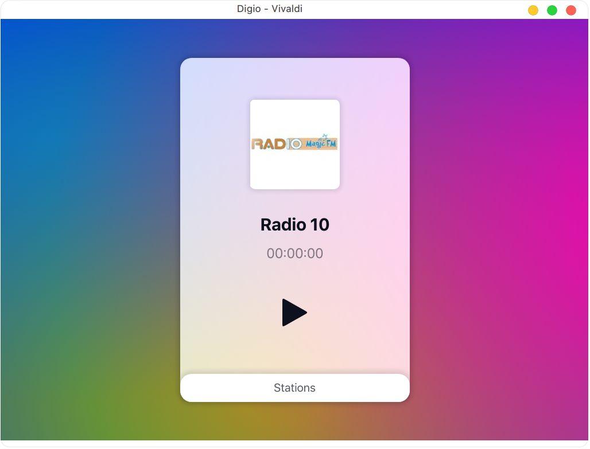

<p align="center">
  
</p>

<h1 align="center">Digio</h1>

<p align="center">Listen to your favorite Surinamese radio stations from anywhere.</p>

<p align="center">
  
</p>

## Keyboard shortcuts

- `Space` - Toggle play and stop
- `Left Arrow` - Switch stations
- `Right Arrow` - Switch stations
- `M` - Open mini player

## Stack

- Sass `4.x`

## Requirements

- Node.js `14.x`

## Getting started

**Install Node.js dependencies**

```sh
npm install
```

## Development

Run the following two commands in parallel:

**Gulp watches for file changes**

```sh
npm run watch
```

The output will be in the **dist** folder.

**Start the local development server**

```sh
npm run serve
```

Open [http://localhost:8000](http://localhost:8000) in your browser.

## Deployment

**Build the app for production**

```sh
npm run build
```

The output will be in the **dist** folder.
